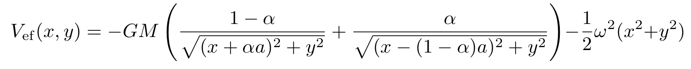

# Lagrange points

Simple interactive webpage displaying Lagrange points and effective potential of two massive objects.
The effective potential is given by

where M = m1 + m2 is the sum of masses, a is the distance between masses, alpha = m2/M, G is gravitational contatnt and x, y are coordinates.
The angular frequency omega is given by Kepler's law

Coordinates of Lagrange points L4 and L5 are given by

y coordinates of Lagrange points L1, L2 and L3 are all y = 0 and x coordinates as a solutions to equation

This potential includes gravitational force between masses and centrifugal force.
In reality there is also Coriolis force present, but it isn't easily visualized that's why we didn't inculde it.
The effect of Coriolis force makes points L4 and L5 stable.

Website is motivated by assigment ([link, in Czech](assets/ukol.pdf)) as a part of Theoretical Mechanics course taught by prof. Jiří Podolský at MFF, Charles University, Prague (see [MFF CUNI website](https://www.mff.cuni.cz/en) and [course website, in Czech](http://utf.mff.cuni.cz/vyuka/OFY003/OFY003.htm)).

Source code available at https://github.com/jansam123/LagrangePoints.
Deployed website available at https://lagrange-points.herokuapp.com.

---

**Author**: Samuel Jankovych
**Email**: samueljankovych@gmail.com
